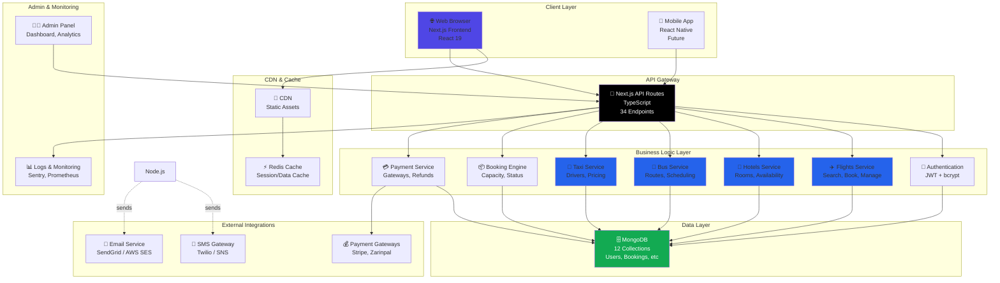
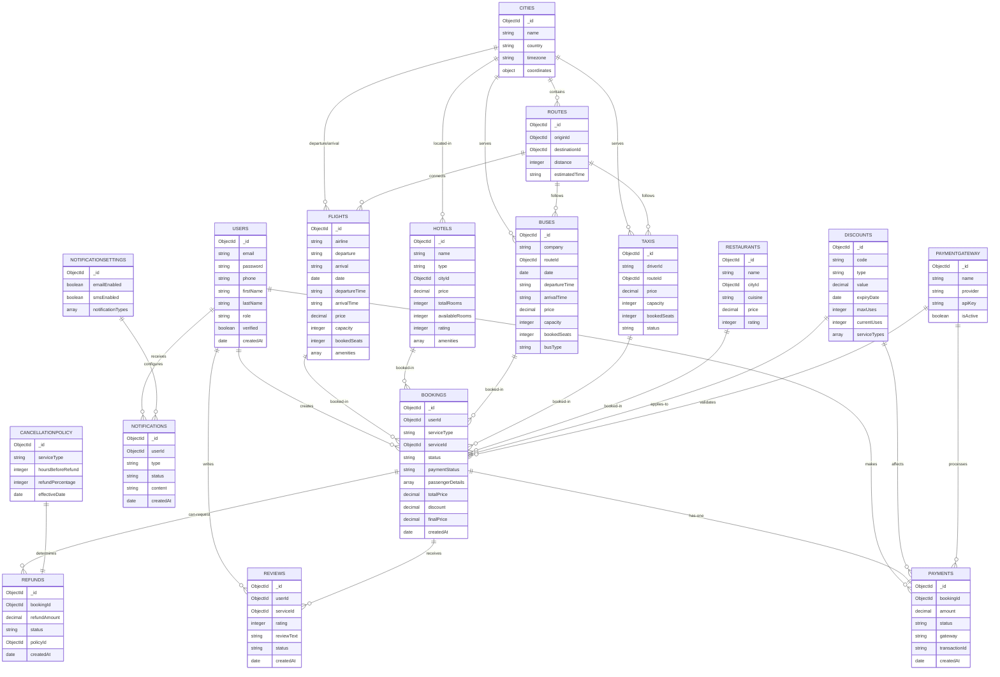
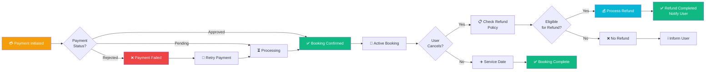
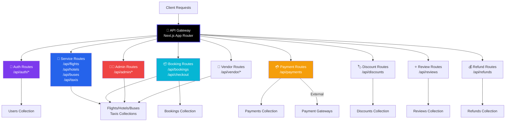
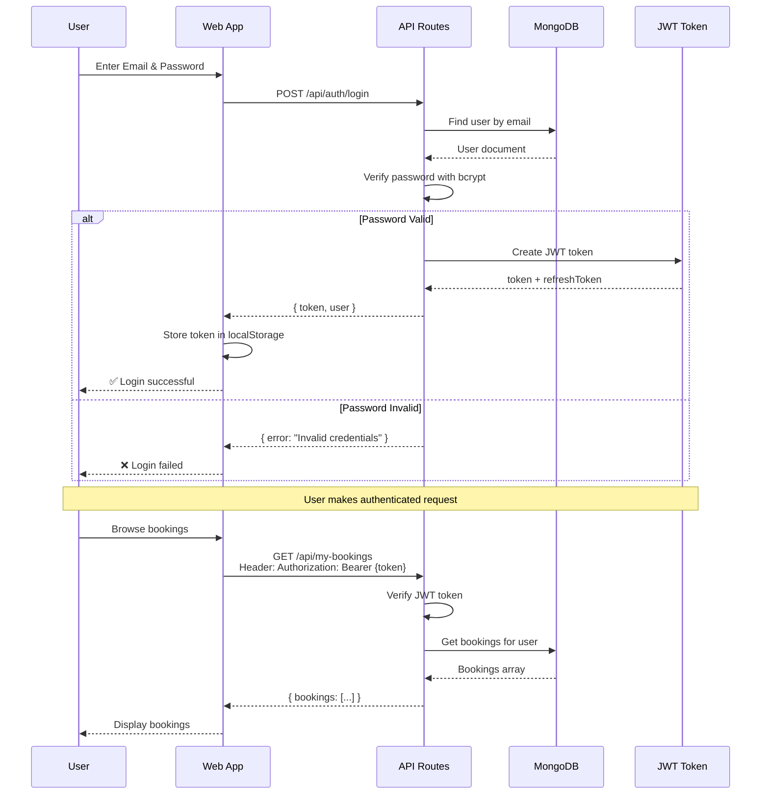
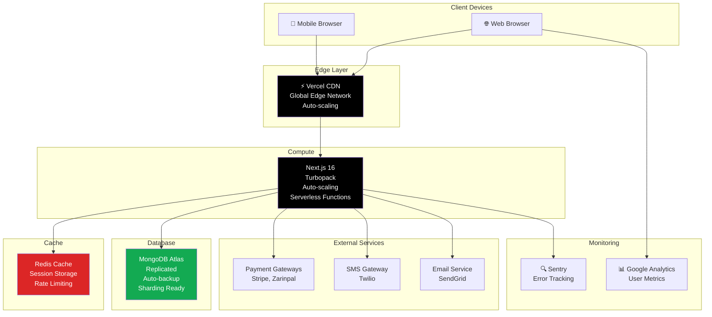
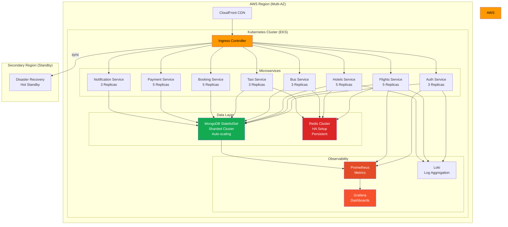
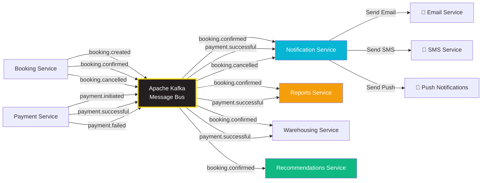

# Humsafar – Visual Architecture Diagrams

## Version: 1.0  
## Date: February 14, 2026

---

## Table of Contents

1. [System Architecture Overview](#1-system-architecture-overview)
2. [Database Entity Relationship Diagram](#2-database-entity-relationship-diagram)
3. [User Journey & Booking Flow](#3-user-journey--booking-flow)
4. [API Gateway & Routing](#4-api-gateway--routing)
5. [Deployment Architecture](#5-deployment-architecture)
6. [Microservices Future State](#6-microservices-future-state)

---

## 1. System Architecture Overview

---

## 2. Database Entity Relationship Diagram

---

## 3. User Journey & Booking Flow

### 3.1 New User Registration and First Booking

### 3.2 Payment & Refund Flow

---

## 4. API Gateway & Routing

### 4.1 API Endpoint Architecture

### 4.2 Authentication Flow

---

## 5. Deployment Architecture

### 5.1 Current Production Setup

### 5.2 Future Kubernetes Setup (Year 2+)

---

## 6. Microservices Future State

### 6.1 Service Decomposition (Year 2)

```mermaid
graph TB
    subgraph "API Gateway"
        APIGW["API Gateway<br/>Kong / AWS API Gateway<br/>Rate Limiting<br/>Authentication"]
    end

    subgraph "Core Services"
        AUTHSVC["🔐 Auth Service<br/>Login | Register | JWT<br/>Port: 3001"]
        USERSVC["👥 User Service<br/>Profile | Settings<br/>Port: 3002"]
    end

    subgraph "Travel Services"
        FLIGHTSVC["✈️ Flight Service<br/>Search | Book | Manage<br/>Port: 3010"]
        HOTELSVC["🏨 Hotel Service<br/>Rooms | Availability<br/>Port: 3011"]
        BUSSVC["🚌 Bus Service<br/>Routes | Schedules<br/>Port: 3012"]
        TAXISVC["🚕 Taxi Service<br/>Drivers | Pricing<br/>Port: 3013"]
    end

    subgraph "Business Services"
        BOOKINGSVC["📦 Booking Service<br/>Create | Manage | Cancel<br/>Port: 3020"]
        PAYMENTSVC["💳 Payment Service<br/>Process | Refund<br/>Port: 3021"]
        NOTIFICATIONSVC["📧 Notification Service<br/>Email | SMS | Push<br/>Port: 3022"]
    end

    subgraph "Admin Services"
        REPORTSVC["📊 Reports Service<br/>Analytics | Dashboards<br/>Port: 3030"]
        VENDORSVC["🏢 Vendor Service<br/>Onboarding | Management<br/>Port: 3031"]
    end

    subgraph "Shared Services"
        CONFIGSVC["⚙️ Config Service<br/>Settings | Features<br/>Port: 3040"]
        SEARCHSVC["🔍 Search Service<br/>Elasticsearch<br/>Port: 3041"]
    end

    subgraph "Data Layer"
        MONGODB["MongoDB<br/>Multi-DB Setup"]
        REDIS["Redis<br/>Cache & Session"]
        ELASTICSEARCH["Elasticsearch<br/>Full-text Search"]
    end

    subgraph "Message Bus"
        KAFKA["Apache Kafka<br/>Event Streaming<br/>order.created<br/>booking.confirmed"]
    end

    APIGW --> AUTHSVC
    APIGW --> USERSVC
    APIGW --> FLIGHTSVC
    APIGW --> HOTELSVC
    APIGW --> BUSSVC
    APIGW --> TAXISVC
    APIGW --> BOOKINGSVC
    APIGW --> PAYMENTSVC
    APIGW --> NOTIFICATIONSVC
    APIGW --> REPORTSVC
    APIGW --> VENDORSVC

    AUTHSVC --> MONGODB
    USERSVC --> MONGODB
    FLIGHTSVC --> MONGODB
    HOTELSVC --> MONGODB
    BUSSVC --> MONGODB
    TAXISVC --> MONGODB
    BOOKINGSVC --> MONGODB
    PAYMENTSVC --> MONGODB
    NOTIFICATIONSVC --> MONGODB

    FLIGHTSVC --> REDIS
    HOTELSVC --> REDIS
    BUSSVC --> REDIS
    TAXISVC --> REDIS

    FLIGHTSVC --> ELASTICSEARCH
    HOTELSVC --> ELASTICSEARCH
    SEARCHSVC --> ELASTICSEARCH

    BOOKINGSVC -->|emit| KAFKA
    PAYMENTSVC -->|emit| KAFKA
    NOTIFICATIONSVC -->|consume| KAFKA
    REPORTSVC -->|consume| KAFKA

    CONFIGSVC --> REDIS

    style APIGW fill:#9333EA,color:#fff
    style MONGODB fill:#13AA52,color:#fff
    style REDIS fill:#DC2626,color:#fff
    style ELASTICSEARCH fill:#F6522D,color:#fff
    style KAFKA fill:#231F20,color:#fff
```

### 6.2 Event-Driven Architecture

---

## Document Control

| Version | Date | Author | Changes |
|---------|------|--------|---------|
| 1.0 | 2026-02-14 | Architecture Team | Initial visual diagrams |

---

**End of Document**
