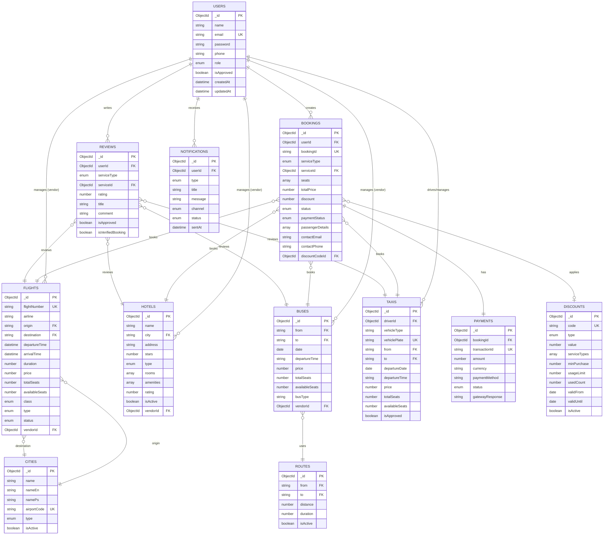

# Humsafar – Database Schema & ERD

## Version: 1.0
## Date: February 13, 2026

---

## Table of Contents

1. [Database Overview](#1-database-overview)
2. [Entity Relationship Diagram](#2-entity-relationship-diagram)
3. [Schema Definitions](#3-schema- Definitions)
4. [Relationships](#4-relationships)
5. [Indexes & Performance](#5-indexes--performance)
6. [Data Dictionary](#6-data-dictionary)
7. [Sample Data](#7-sample-data)

---

## 1. Database Overview

### 1.1 Database Type
**MongoDB** (Document-oriented NoSQL)

### 1.2 Database Name
`humsafar` (Production)  
`humsafar_staging` (Staging)  
`humsafar_dev` (Development)

### 1.3 Connection String
```
mongodb+srv://<username>:<password>@cluster0.mongodb.net/humsafar?retryWrites=true&w=majority
```

### 1.4 Collections Summary

| # | Collection | Purpose | Est. Size |
|---|------------|---------|-----------|
| 1 | users | User accounts & authentication | 10K-1M |
| 2 | flights | Flight inventory & scheduling | 1K-100K |
| 3 | hotels | Hotels, rooms & properties | 500-50K |
| 4 | buses | Bus routes & schedules | 500-10K |
| 5 | taxis | Taxi service listings | 1K-50K |
| 6 | bookings | All service bookings | 10K-1M |
| 7 | payments | Payment transactions | 10K-1M |
| 8 | reviews | User reviews & ratings | 5K-500K |
| 9 | discounts | Promotional codes | 50-1K |
| 10 | notifications | Email/SMS notifications | 50K-5M |
| 11 | cities | Cities & airports database | 100-1K |
| 12 | routes | Travel routes | 500-10K |

---

## 2. Entity Relationship Diagram

### 2.1 ERD Diagram (Mermaid)



### 2.2 Simplified Relationship View

```
┌───────────┐
│   USERS   │
└─────┬─────┘
      │
      ├──────────────┬──────────────┬──────────────┐
      │              │              │              │
      ↓              ↓              ↓              ↓
┌──────────┐   ┌─────────┐   ┌─────────┐   ┌─────────────┐
│ BOOKINGS │   │ REVIEWS │   │  TAXIS  │   │NOTIFICATIONS│
└────┬─────┘   └────┬────┘   └─────────┘   └─────────────┘
     │              │
     │              │
┌────┴──────────────┴────┐
│                        │
↓                        ↓
┌──────────┐       ┌──────────┐
│ PAYMENTS │       │ SERVICES │
└──────────┘       │(Polymorphic)│
                   ├─ FLIGHTS
                   ├─ HOTELS
                   ├─ BUSES
                   └─ TAXIS
```

---

## 3. Schema Definitions

### 3.1 Users Collection

```typescript
{
  _id: ObjectId,
  name: String (required, index),
  email: String (required, unique, index),
  password: String (required, hashed with bcrypt),
  phone: String,
  role: Enum ['user', 'vendor', 'admin'] (default: 'user', index),
  isApproved: Boolean (default: false, index),
  profileImage: String,
  companyName: String (for vendors),
  createdAt: DateTime (auto),
  updatedAt: DateTime (auto)
}
```

**Indexes**:
- `{ email: 1 }` (unique)
- `{ role: 1, isApproved: 1 }`

**Validation Rules**:
- Email must be valid format
- Password minimum 6 characters
- Role can only be user, vendor, or admin

---

### 3.2 Flights Collection

```typescript
{
  _id: ObjectId,
  flightNumber: String (required, unique, index),
  airline: String (required, index),
  origin: String (required, ref: cities.name, index),
  destination: String (required, ref: cities.name, index),
  departureTime: DateTime (required, index),
  arrivalTime: DateTime (required),
  duration: Number (minutes, required),
  price: Number (required, min: 0),
  currency: String (default: 'AFN'),
  totalSeats: Number (required, min: 1),
  availableSeats: Number (required, min: 0),
  class: Enum ['economy', 'business', 'first'] (default: 'economy'),
  type: Enum ['domestic', 'international'] (required, index),
  status: Enum ['scheduled', 'delayed', 'cancelled', 'completed'] (default: 'scheduled'),
  amenities: Array<String>,
  baggage: {
    cabin: Number (kg, default: 7),
    checked: Number (kg, default: 23)
  },
  vendorId: ObjectId (ref: users._id),
  createdAt: DateTime,
  updatedAt: DateTime
}
```

**Indexes**:
- `{ flightNumber: 1 }` (unique)
- `{ origin: 1, destination: 1, departureTime: 1 }` (compound for search)
- `{ type: 1, status: 1 }`
- `{ airline: 1 }`

**Business Rules**:
- `availableSeats` <= `totalSeats`
- `departureTime` < `arrivalTime`
- Auto-decrement `availableSeats` on booking

---

### 3.3 Hotels Collection

```typescript
{
  _id: ObjectId,
  name: String (required, index),
  description: String (required),
  city: String (required, ref: cities.name, index),
  address: String (required),
  location: {
    latitude: Number,
    longitude: Number
  },
  stars: Number (required, min: 1, max: 5, index),
  type: Enum ['hotel', 'guesthouse', 'apartment', 'rental'] (required, index),
  rooms: [
    {
      roomType: String (required),
      price: Number (required, min: 0),
      totalRooms: Number (required, min: 1),
      availableRooms: Number (required, min: 0),
      capacity: Number (required, min: 1),
      amenities: Array<String>
    }
  ],
  amenities: Array<String>,
  images: Array<String>,
  rating: Number (default: 0, min: 0, max: 5),
  reviewCount: Number (default: 0),
  checkInTime: String (default: '14:00'),
  checkOutTime: String (default: '12:00'),
  policies: {
    cancellation: String,
    children: String,
    pets: Boolean (default: false)
  },
  contact: {
    phone: String,
    email: String
  },
  vendorId: ObjectId (ref: users._id),
  isActive: Boolean (default: true),
  createdAt: DateTime,
  updatedAt: DateTime
}
```

**Indexes**:
- `{ city: 1, stars: 1, isActive: 1 }` (compound for search)
- `{ rating: -1 }` (for sorting)

**Business Rules**:
- At least one room type required
- `rooms[].availableRooms` <= `rooms[].totalRooms`
- `rating` auto-calculated from reviews

---

### 3.4 Buses Collection

```typescript
{
  _id: ObjectId,
  vendorId: ObjectId (ref: users._id, required, index),
  company: String (required),
  from: String (required, ref: cities.name, index),
  to: String (required, ref: cities.name, index),
  date: Date (required, index),
  departureTime: String (required),
  arrivalTime: String (required),
  price: Number (required, min: 0),
  currency: String (default: 'AFN'),
  totalSeats: Number (required, min: 1),
  availableSeats: Number (required, min: 0),
  busType: String (required),
  amenities: Array<String>,
  rating: Number (default: 0),
  status: Enum ['active', 'completed', 'cancelled'] (default: 'active'),
  createdAt: DateTime,
  updatedAt: DateTime
}
```

**Indexes**:
- `{ from: 1, to: 1, date: 1 }` (compound for search)
- `{ vendorId: 1, status: 1 }`

**Business Rules**:
- `availableSeats` <= `totalSeats`
- `date` must be future date
- Auto-decrement `availableSeats` on booking

---

### 3.5 Taxis Collection

```typescript
{
  _id: ObjectId,
  driverId: ObjectId (ref: users._id, required, index),
  driverName: String (required),
  driverPhone: String (required),
  vehicleType: Enum ['sedan', 'suv', 'minivan', 'luxury'] (required, index),
  vehicleModel: String (required),
  vehiclePlate: String (required, unique),
  vehicleColor: String (required),
  from: String (required, ref: cities.name, index),
  to: String (required, ref: cities.name, index),
  departureDate: Date (required, index),
  departureTime: String (required),
  price: Number (required, min: 0),
  currency: String (default: 'AFN'),
  totalSeats: Number (required, min: 1, max: 7),
  availableSeats: Number (required, min: 0),
  amenities: Array<String>,
  status: Enum ['active', 'completed', 'cancelled'] (default: 'active'),
  isApproved: Boolean (default: false, index),
  createdAt: DateTime,
  updatedAt: DateTime
}
```

**Indexes**:
- `{ from: 1, to: 1, departureDate: 1, isApproved: 1 }` (compound)
- `{ driverId: 1, status: 1 }`
- `{ vehiclePlate: 1 }` (unique)

**Business Rules**:
- `totalSeats` max 7 (vehicle capacity limit)
- Requires admin approval (`isApproved = true`)
- `availableSeats` <= `totalSeats`

---

### 3.6 Bookings Collection

```typescript
{
  _id: ObjectId,
  userId: ObjectId (ref: users._id, required, index),
  bookingId: String (required, unique, generated),
  serviceType: Enum ['flight', 'hotel', 'bus', 'taxi'] (required, index),
  serviceId: ObjectId (required, index),
  seats: Array<String> (seat numbers/room numbers),
  totalPrice: Number (required, min: 0),
  discount: Number (default: 0),
  finalPrice: Number (required),
  status: Enum ['pending', 'confirmed', 'cancelled', 'completed'] (default: 'pending'),
  paymentStatus: Enum ['pending', 'paid', 'failed', 'refunded'] (default: 'pending', index),
  passengerDetails: [
    {
      firstName: String (required),
      lastName: String (required),
      fatherName: String,
      passportId: String,
      dateOfBirth: Date,
      gender: Enum ['male', 'female'],
      email: String,
      phone: String,
      specialNote: String
    }
  ],
  contactEmail: String (required),
  contactPhone: String (required),
  discountCodeId: ObjectId (ref: discounts._id),
  createdAt: DateTime (index),
  updatedAt: DateTime
}
```

**Indexes**:
- `{ userId: 1, status: 1 }`
- `{ bookingId: 1 }` (unique)
- `{ serviceType: 1, serviceId: 1 }`
- `{ paymentStatus: 1, createdAt: -1 }`

**Business Rules**:
- `finalPrice = totalPrice - discount`
- At least one passenger detail required
- Cannot book more seats than available

---

### 3.7 Payments Collection

```typescript
{
  _id: ObjectId,
  bookingId: ObjectId (ref: bookings._id, required, unique, index),
  userId: ObjectId (ref: users._id, required, index),
  transactionId: String (required, unique),
  amount: Number (required, min: 0),
  currency: String (default: 'AFN'),
  paymentMethod: Enum ['online', 'cash', 'bank_transfer'] (required),
  gateway: String (e.g., 'MPay', 'AziziBank'),
  status: Enum ['pending', 'completed', 'failed', 'refunded'] (default: 'pending', index),
  gatewayResponse: Object,
  refundAmount: Number (default: 0),
  refundReason: String,
  createdAt: DateTime,
  updatedAt: DateTime
}
```

**Indexes**:
- `{ bookingId: 1 }` (unique)
- `{ transactionId: 1 }` (unique)
- `{ userId: 1, status: 1 }`

**Business Rules**:
- One payment per booking
- `refundAmount` <= `amount`
- Status auto-updates booking on success/failure

---

### 3.8 Reviews Collection

```typescript
{
  _id: ObjectId,
  userId: ObjectId (ref: users._id, required, index),
  userName: String (required),
  serviceType: Enum ['flight', 'hotel', 'bus', 'taxi'] (required, index),
  serviceId: ObjectId (required, index),
  rating: Number (required, min: 1, max: 5),
  title: String (required),
  comment: String (required),
  pros: Array<String>,
  cons: Array<String>,
  isApproved: Boolean (default: false, index),
  isVerifiedBooking: Boolean (default: false),
  adminResponse: String,
  helpfulCount: Number (default: 0),
  createdAt: DateTime,
  updatedAt: DateTime
}
```

**Indexes**:
- `{ serviceType: 1, serviceId: 1, isApproved: 1 }` (compound)
- `{ rating: -1 }`
- `{ userId: 1 }`

**Business Rules**:
- One review per user per service
- Requires admin approval before display
- `isVerifiedBooking` = true if user has booking for this service

---

### 3.9 Discounts Collection

```typescript
{
  _id: ObjectId,
  code: String (required, unique, uppercase, index),
  description: String (required),
  type: Enum ['percentage', 'fixed'] (required),
  value: Number (required, min: 0),
  serviceTypes: Array<Enum> (['flight', 'hotel', 'bus', 'taxi']),
  minPurchase: Number (default: 0),
  maxDiscount: Number,
  usageLimit: Number (default: 0, 0 = unlimited),
  usedCount: Number (default: 0),
  validFrom: Date (required),
  validUntil: Date (required),
  isActive: Boolean (default: true, index),
  createdBy: ObjectId (ref: users._id, required),
  createdAt: DateTime,
  updatedAt: DateTime
}
```

**Indexes**:
- `{ code: 1, isActive: 1 }` (compound)
- `{ validFrom: 1, validUntil: 1 }`

**Business Rules**:
- `usedCount` <= `usageLimit` (if usageLimit > 0)
- Current date must be between `validFrom` and `validUntil`
- For percentage: `value` <= 100

---

### 3.10 Notifications Collection

```typescript
{
  _id: ObjectId,
  userId: ObjectId (ref: users._id, required, index),
  type: Enum ['booking', 'payment', 'reminder', 'refund', 'general'] (required, index),
  title: String (required),
  message: String (required),
  channel: Enum ['email', 'sms', 'both'] (required),
  status: Enum ['pending', 'sent', 'failed'] (default: 'pending', index),
  metadata: {
    bookingId: String,
    serviceType: String,
    amount: Number
  },
  sentAt: DateTime,
  createdAt: DateTime,
  updatedAt: DateTime
}
```

**Indexes**:
- `{ userId: 1, status: 1 }`
- `{ type: 1, createdAt: -1 }`

**Business Rules**:
- Auto-mark as 'sent' after successful delivery
- TTL index (auto-delete after 90 days)

---

### 3.11 Cities Collection

```typescript
{
  _id: ObjectId,
  name: String (required, index),
  nameEn: String (required),
  namePs: String (required),
  country: String (default: 'Afghanistan'),
  airportCode: String (uppercase, sparse unique, index),
  type: Enum ['domestic', 'international'] (required, index),
  isActive: Boolean (default: true, index),
  location: {
    latitude: Number,
    longitude: Number
  },
  timezone: String (default: 'Asia/Kabul'),
  createdAt: DateTime,
  updatedAt: DateTime
}
```

**Indexes**:
- `{ name: 1, isActive: 1 }`
- `{ airportCode: 1 }` (sparse unique)
- `{ type: 1, isActive: 1 }`

**Business Rules**:
- `airportCode` required for international cities
- Unique name per country

---

### 3.12 Routes Collection

```typescript
{
  _id: ObjectId,
  from: String (required, ref: cities.name),
  to: String (required, ref: cities.name),
  distance: Number (km),
  duration: Number (minutes),
  isActive: Boolean (default: true),
  createdAt: DateTime,
  updatedAt: DateTime
}
```

**Indexes**:
- `{ from: 1, to: 1 }` (compound unique)
- `{ isActive: 1 }`

**Business Rules**:
- `from` cannot equal `to`
- Distance and duration used for estimation

---

## 4. Relationships

### 4.1 One-to-Many Relationships

**User → Bookings**
```javascript
// Find all bookings by a user
db.bookings.find({ userId: ObjectId("user_id") })

// Population in Mongoose
Booking.find({ userId: userId }).populate('userId', 'name email')
```

**User → Reviews**
```javascript
// Find all reviews by a user
db.reviews.find({ userId: ObjectId("user_id") })
```

**Vendor → Flights/Hotels/Buses**
```javascript
// Find all flights managed by a vendor
db.flights.find({ vendorId: ObjectId("vendor_id") })
```

### 4.2 Polymorphic Relationships

**Booking → Service (Flight/Hotel/Bus/Taxi)**
```javascript
// Get booking with service details
const booking = await Booking.findById(bookingId);
let service;

switch (booking.serviceType) {
  case 'flight':
    service = await Flight.findById(booking.serviceId);
    break;
  case 'hotel':
    service = await Hotel.findById(booking.serviceId);
    break;
  case 'bus':
    service = await Bus.findById(booking.serviceId);
    break;
  case 'taxi':
    service = await Taxi.findById(booking.serviceId);
    break;
}
```

**Review → Service (Polymorphic)**
```javascript
// Same pattern as Booking → Service
```

### 4.3 One-to-One Relationships

**Booking → Payment**
```javascript
// One booking has one payment
db.payments.findOne({ bookingId: ObjectId("booking_id") })

// In Mongoose
Payment.findOne({ bookingId: bookingId }).populate('bookingId')
```

---

## 5. Indexes & Performance

### 5.1 Critical Indexes

**Search Performance**:
```javascript
// Flight search
flights: { origin: 1, destination: 1, departureTime: 1 }

// Hotel search
hotels: { city: 1, stars: 1, isActive: 1 }

// Bus search
buses: { from: 1, to: 1, date: 1 }

// Taxi search
taxis: { from: 1, to: 1, departureDate: 1, isApproved: 1 }
```

**User Experience**:
```javascript
// User bookings
bookings: { userId: 1, status: 1 }
bookings: { paymentStatus: 1, createdAt: -1 }

// Service reviews
reviews: { serviceType: 1, serviceId: 1, isApproved: 1 }
```

### 5.2 Query Optimization Examples

**Efficient Query**:
```javascript
// Good: Uses index
db.flights.find({
  origin: "Kabul",
  destination: "Dubai",
  departureTime: { $gte: new Date("2026-03-01") }
}).lean();

// Bad: No index on 'airline'
db.flights.find({ airline: /Mahan/i });

// Fixed: Add index
db.flights.createIndex({ airline: 1 });
```

**Aggregation Pipeline**:
```javascript
// Calculate average rating for a hotel
db.reviews.aggregate([
  { $match: { serviceType: "hotel", serviceId: hotelId, isApproved: true } },
  { $group: { _id: null, avgRating: { $avg: "$rating" }, count: { $sum: 1 } } }
]);
```

---

## 6. Data Dictionary

### 6.1 Common Enums

**User Roles**:
- `user` - Regular customer
- `vendor` - Service provider (flight/hotel/bus company)
- `admin` - Platform administrator

**Service Types**:
- `flight` - Flight service
- `hotel` - Hotel/accommodation
- `bus` - Bus service
- `taxi` - Taxi service

**Booking Status**:
- `pending` - Awaiting payment
- `confirmed` - Payment completed
- `cancelled` - User/admin cancelled
- `completed` - Service fulfilled

**Payment Status**:
- `pending` - Payment not yet processed
- `paid` - Payment successful
- `failed` - Payment failed
- `refunded` - Amount refunded

**Notification Types**:
- `booking` - Booking confirmation
- `payment` - Payment confirmation
- `reminder` - Travel reminder (1-3h before)
- `refund` - Refund notification
- `general` - General announcements

---

## 7. Sample Data

### 7.1 Sample User
```json
{
  "_id": ObjectId("507f1f77bcf86cd799439011"),
  "name": "احمد رحمانی",
  "email": "ahmad@example.com",
  "password": "$2a$10$hash...",
  "phone": "+93700123456",
  "role": "user",
  "isApproved": true,
  "createdAt": ISODate("2026-01-15T10:00:00Z"),
  "updatedAt": ISODate("2026-01-15T10:00:00Z")
}
```

### 7.2 Sample Flight
```json
{
  "_id": ObjectId("507f1f77bcf86cd799439022"),
  "flightNumber": "W5-101",
  "airline": "ماهان",
  "origin": "کابل",
  "destination": "دوبی",
  "departureTime": ISODate("2026-03-01T08:00:00Z"),
  "arrivalTime": ISODate("2026-03-01T10:30:00Z"),
  "duration": 150,
  "price": 220,
  "currency": "AFN",
  "totalSeats": 180,
  "availableSeats": 150,
  "class": "economy",
  "type": "international",
  "status": "scheduled",
  "amenities": ["meal", "wifi"],
  "baggage": {
    "cabin": 7,
    "checked": 23
  },
  "vendorId": ObjectId("507f1f77bcf86cd799439033")
}
```

### 7.3 Sample Booking
```json
{
  "_id": ObjectId("507f1f77bcf86cd799439044"),
  "userId": ObjectId("507f1f77bcf86cd799439011"),
  "bookingId": "BK-20260213-001",
  "serviceType": "flight",
  "serviceId": ObjectId("507f1f77bcf86cd799439022"),
  "seats": ["12A", "12B"],
  "totalPrice": 440,
  "discount": 44,
  "finalPrice": 396,
  "status": "confirmed",
  "paymentStatus": "paid",
  "passengerDetails": [
    {
      "firstName": "احمد",
      "lastName": "رحمانی",
      "passportId": "P1234567",
      "dateOfBirth": ISODate("1990-01-01"),
      "gender": "male",
      "email": "ahmad@example.com",
      "phone": "+93700123456"
    }
  ],
  "contactEmail": "ahmad@example.com",
  "contactPhone": "+93700123456",
  "discountCodeId": ObjectId("507f1f77bcf86cd799439055"),
  "createdAt": ISODate("2026-02-13T12:00:00Z")
}
```

---

## Document Control

| Version | Date | Author | Changes |
|---------|------|--------|---------|
| 1.0 | 2026-02-13 | Database Team | Initial ERD document |

---

**End of Document**
